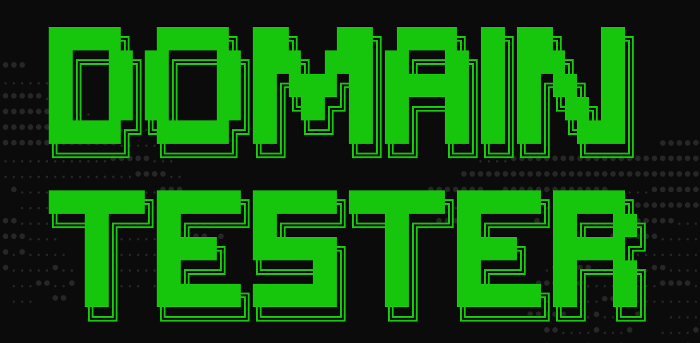

# Domain Tester
### Vérifier la disponibilité des domaines de premier niveau
---
## Fonctionnement

Le script effectue une vérification en 4 niveaux pour chaque domaine :
1. Résolution DNS + connectivité
2. RDAP officiel
3. WHOIS
4. RDAP fallback

---
## Fonctionnalités
- Vérification en masse sur ~300 TLDs ou domaine unique
- Multi-thread
- Sauvegarde des résultats en `.txt`
- Compatible Windows et Linux

---
## Installation

```bash
git clone https://github.com/youruser/domain-tester
cd domain-tester
python main.py
```

Aucune dépendance externe — uniquement la bibliothèque standard Python.

---
## Utilisation

```
1. Global SLD check   → teste un SLD sur tous les TLDs de la liste
2. Single domain check → teste un domaine complet
3. Exit
```

Lancer via le `.bat` sur Windows pour redémarrage automatique en cas d'erreur.

---
## Supporte-moi
### [ko-fi.com/zoltex](https://ko-fi.com/zoltex)
